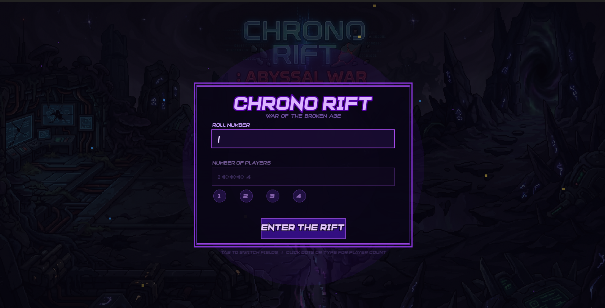
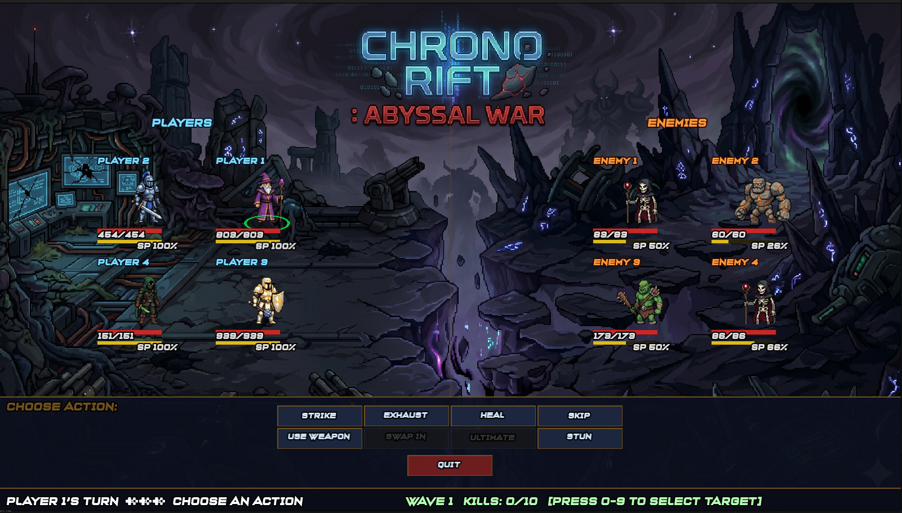
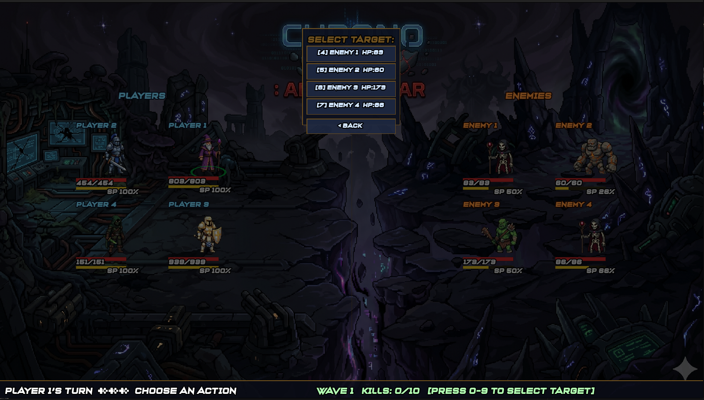
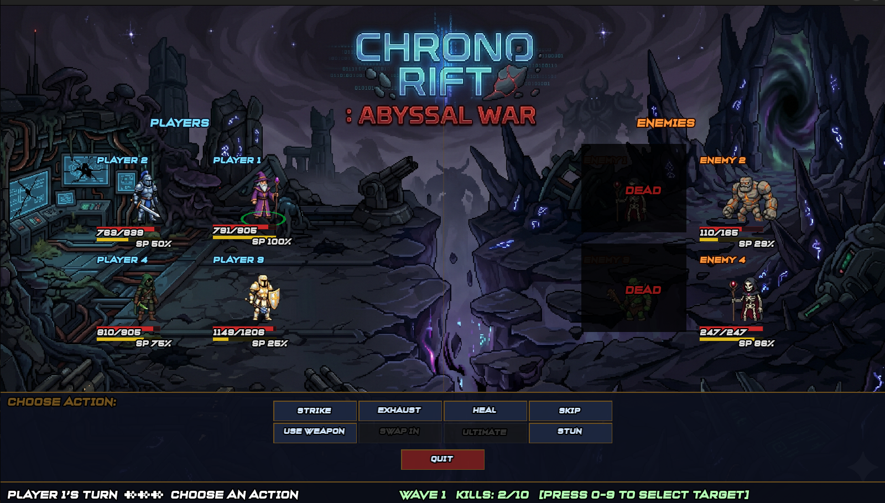
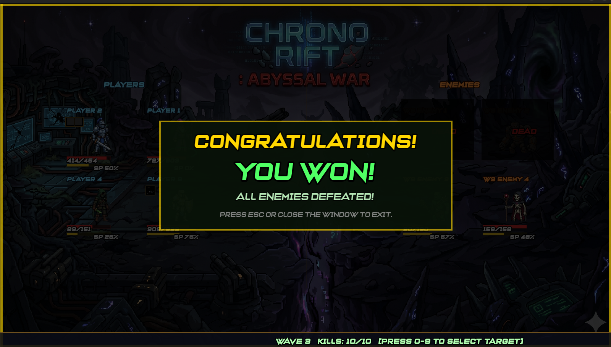
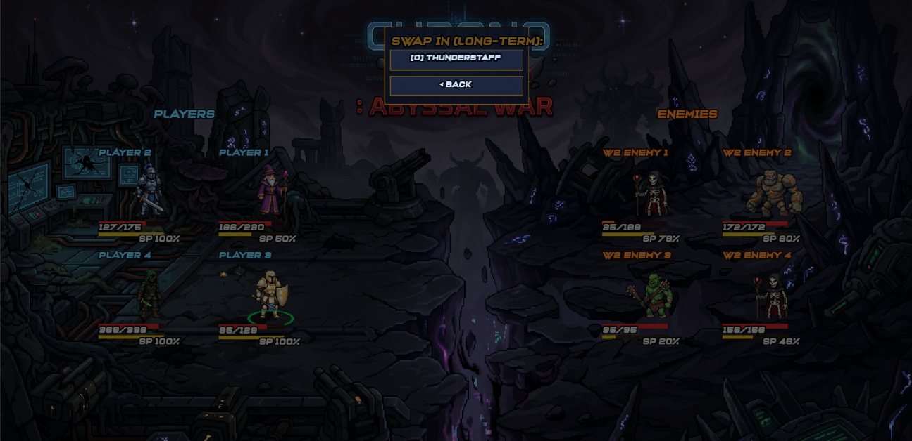
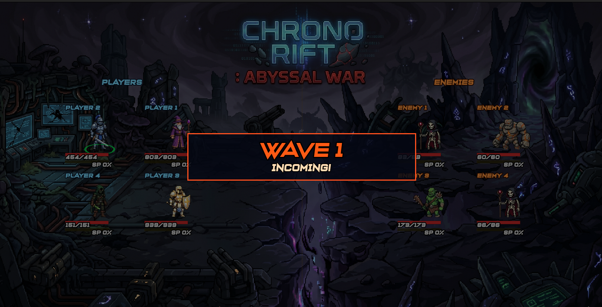
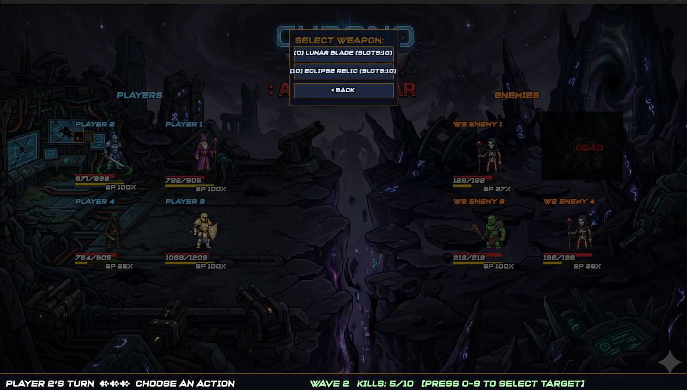

# Chrono Rift OS ⏳🎮

Chrono Rift OS is a sophisticated multi-process Linux game developed in C++17, meticulously engineered to demonstrate fundamental Operating System concepts. This project showcases advanced inter-process communication (IPC) mechanisms, concurrent programming patterns, and robust system-level interactions within an interactive ncurses-based Terminal User Interface (TUI) game environment.

## 🌟 Project Overview

This game serves as a practical exposition of various OS principles, including:

*   **POSIX Shared Memory**: Facilitating high-performance data exchange between distinct processes.
*   **Semaphores**: Synchronizing access to shared resources and managing concurrent operations.
*   **Pthreads**: Leveraging multi-threading within processes for responsive and parallel execution.
*   **Ncurses TUI**: Providing a dynamic and interactive graphical experience directly within the terminal.
*   **Signal Handling**: Implementing graceful shutdown, error management, and real-time event responses across processes.
*   **Multi-process Architecture**: Orchestrating three concurrent processes (`Arbiter`, `ASP`, `HIP`) to collaboratively manage game logic, rendering, and player interactions.

Built with a professional and educational focus, Chrono Rift OS offers a unique blend of gaming and systems programming, making complex OS concepts tangible and interactive.

## 🚀 Key Technologies

*   **Primary Language**: C++17
*   **Build System**: GNU Make
*   **Inter-Process Communication**: POSIX Shared Memory, Semaphores
*   **Concurrency**: pthreads
*   **User Interface**: ncurses library
*   **Platform**: Linux
*   **Containerization**: Docker

## ⚙️ Installation

To set up and run Chrono Rift OS, you have two primary options: native compilation on a Linux system or using Docker for containerized execution.

### Prerequisites ✨

*   **Native**:
    *   A C++17 compliant compiler (e.g., `g++` version 7 or newer).
    *   `make` build system.
    *   `libncurses-dev` (or equivalent package for your Linux distribution, e.g., `ncurses-devel` on Fedora).
        *   On Ubuntu/Debian: `sudo apt-get update && sudo apt-get install build-essential libncurses-dev`
*   **Docker**:
    *   Docker Engine installed and running.

### 🐧 Native Compilation

1.  **Clone the Repository**:
    ```bash
    git clone https://github.com/your-username/chrono-rift-os.git
    cd chrono-rift-os/submission
    ```
    _Replace `your-username` with the actual GitHub username if forking._

2.  **Compile the Project**:
    Navigate to the `submission` directory which contains the `Makefile` and source code.
    ```bash
    make
    ```
    This command will compile the `arbiter`, `asp`, and `hip` executables, along with any necessary shared libraries or modules.

3.  **Clean Build Artifacts (Optional)**:
    To remove all compiled binaries and object files:
    ```bash
    make clean
    ```

### 🐳 Docker Installation

1.  **Clone the Repository**:
    ```bash
    git clone https://github.com/your-username/chrono-rift-os.git
    cd chrono-rift-os/submission
    ```

2.  **Build the Docker Image**:
    From the `submission` directory, build the Docker image. The `Dockerfile` is configured to set up the environment and compile the game.
    ```bash
    docker build -t chrono-rift-os .
    ```

## 🎮 Usage

After successful installation, you can launch Chrono Rift OS either natively or via Docker.

### 🖥️ Native Execution

1.  **Navigate to the Executables**:
    Ensure you are in the `submission` directory where the executables were built.
    ```bash
    cd chrono-rift-os/submission
    ```

2.  **Run the Game**:
    The game is typically initiated by running the `arbiter` process, which then orchestrates the other game components (`asp`, `hip`) through inter-process communication.
    ```bash
    ./arbiter/arbiter
    ```
    _Note: Depending on the specific design, you might need to run `asp/asp` and `hip/hip` in separate terminal windows if they are designed to be independently started. The `arbiter` is generally the main entry point for game logic._

### 🚢 Docker Execution

1.  **Run the Docker Container**:
    Once the Docker image is built, you can run it. The `docker_commands.txt` file (if present) might provide the exact command. A typical run command, mapping the terminal for ncurses, would be:
    ```bash
    docker run --rm -it chrono-rift-os
    ```
    This command starts a new container from the `chrono-rift-os` image, runs it interactively (`-it`), and removes the container upon exit (`--rm`).

## 🖼️ Gameplay

Explore the immersive world of Chrono Rift OS through these captivating in-game screenshots, showcasing various stages of player interaction, combat, and progress.

### Login Screen 🔑

_Players begin their adventure by logging into the game._

### Initial Game Environment Rendering 🌍

_A glimpse of the ncurses TUI, showcasing the initial game world and character._

### Enemy Attacking Player ⚔️

_Dynamic combat sequences where enemies engage the player._

### Defeated Enemy ☠️

_The aftermath of a successful battle, with a defeated foe._

### Game Victory Screen 🎉

_Celebrating a hard-fought victory as the player conquers the game._

### Persistent Game Progress Display 📈

_Tracking long-term progress and statistics within the game._

### Incoming Enemy Wave Notification 🌊

_Alerts for new challenges as waves of enemies approach._

### Player Weapon Inventory 🎒

_Managing and selecting weapons from the player's inventory._

## 🤝 Contributing

We welcome contributions to Chrono Rift OS! If you're interested in improving the game or enhancing its educational value, please consider the following:

1.  **Fork the Repository** 🍴
    Start by forking the `chrono-rift-os` repository to your GitHub account.
2.  **Create a New Branch** 🌱
    Create a new branch for your feature or bug fix:
    ```bash
    git checkout -b feature/your-feature-name
    ```
3.  **Make Your Changes** ✏️
    Implement your improvements, ensuring they align with the project's objectives and C++17 best practices.
4.  **Test Thoroughly** ✅
    Before submitting, ensure your changes do not introduce new bugs and work as expected.
5.  **Commit Your Changes** 💾
    Write clear and concise commit messages:
    ```bash
    git commit -m "feat: Add new feature"
    ```
6.  **Push to Your Branch** ⬆️
    Push your changes to your forked repository:
    ```bash
    git push origin feature/your-feature-name
    ```
7.  **Open a Pull Request** 💬
    Submit a pull request to the `main` branch of the original repository, detailing your changes and their benefits.

---

Team: Ahmad Bilal 23i-0787, Abdul Rauf 23i-0591
